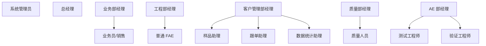

# 01 角色权限与授权模型

## 1. 主体隔离

`CustomerIdentity`、`InternalEmployee` 和 `SystemAdministrator` 是不同主体类型。客户 FAE 与芯茂微普通 FAE 名称相似，但数据范围、职责和操作完全不同；不得用邮箱域名或单一 `ADMIN/USER` 字段代替主体模型。

访问结果由以下因素共同决定：

```text
资源等级 + 身份状态 + 所属组织 + 对象归属 + 项目关系 + NDA/专项授权 + 资源版本/生命周期
```

## 2. 客户侧角色与资源授权

| 客户状态/角色 | 默认任务 | 可执行动作 | 默认不可见 |
| --- | --- | --- | --- |
| 匿名访客 | 找型号、方案、资料、快速选型 | 公开搜索、公开资料前三页预览 | 收藏、下载受限资料、企业/项目资源 |
| 注册个人 | 保存个人技术工作 | 收藏、订阅、完整预览/下载开放资料、通用咨询 | 任意企业或项目资源 |
| 客户 FAE/工程师 | 技术选型与验证 | 保存选型、查看授权资料、提交技术问题、参与获授权项目 | 其他客户、原厂内部讨论/质量记录 |
| 客户采购 | 订货、生命周期、合规、样品/RFQ | 查看授权采购资料、发起询价/样品、确认变更 | 修改技术结论、分配原厂人员 |
| 客户 PM/管理者 | 企业协作和项目治理 | 管理本组织成员、项目和授权范围 | 芯茂微内部运营事实 |

资源等级固定为：`PUBLIC`、`REGISTERED`、`ORG`、`PROJECT`、`NDA`。每个资源版本都有一个资源等级；授权变化不改写文件、产品或方案事实。

## 3. 芯茂微组织与职责



| 角色 | 负责事实 | 默认工作台 | 不承担的责任 |
| --- | --- | --- | --- |
| 总经理 | 经营目标、重大资源与风险决策 | 公司驾驶舱 | 日常资料维护 |
| 业务部经理/销售 | 客户关系、商机、商务推进、销售资源 | 销售经营台 | 技术/质量结论 |
| 工程部经理/普通 FAE | 技术支持、选型结论、支持 SLA、项目技术阶段 | FAE 技术作业台 | 订单和质量原始数据 |
| 客户管理部/样品助理/跟单助理/数据统计助理 | 样品、跟单、客户服务、数据质量与报表 | 样品跟单/数据队列 | 技术结论和客户归属裁决 |
| 质量部/质量人员 | 质量事件、PCN、CAPA、质量报告 | 质量与变更台 | 销售归属和技术替代结论 |
| AE 部/测试/验证工程师 | 测试计划、原始数据、验证和报告 | 测试验证台 | 商务与客户权限配置 |
| 系统管理员 | 全局账号、配置、权限、集成、安全与审计 | 系统治理台 | 代替业务责任人而不留痕 |

## 4. 系统管理员的全权限

系统管理员拥有全系统任意资源、任意数据范围和任意动作的最终权限，包括跨部门数据查看、权限覆盖、配置发布、账号接管、数据维护、应急冻结和系统恢复。普通业务角色、组织范围与审批流不得阻止管理员执行这些动作。

为保障企业可追责性，删除、全量导出、授权覆盖、发布版本变更、代操作、关闭审计和生产配置变更必须进入 `break-glass` 记录：原因、操作者、时间、目标、前后值、来源 IP、通知对象和恢复点均不可省略。系统管理员可覆盖审批，但结果必须标记为“管理员覆盖”，不能伪装为业务责任人结论。

## 5. 权限与流程边界

| 层 | 决策内容 | 例子 |
| --- | --- | --- |
| 身份层 | 客户/内部/管理员/访客 | 客户不能进入内部作业台 |
| 组织层 | 客户企业、芯茂微部门、业务部 | 销售默认只看获分配客户 |
| 对象层 | 产品、方案、文件、项目、样品、质量事件 | 普通 FAE 默认只看获分配项目 |
| 动作层 | read/create/update/approve/publish/export/assign/override | 测试工程师提交报告，质量经理发布；管理员可覆盖 |

以下动作必须有工作流或明确授权，而不是只靠静态角色：受限资料访问、方案/报告/PCN 发布、样品/RFQ、跨部门 FAE 支援、客户项目阶段推进和重大项目归属冲突。

所有授权、下载、导出、发布、审批、删除、管理员覆盖和失败授权都产生审计事件。审计事件不可由普通业务操作修改。
